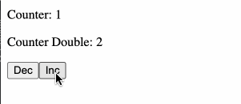

## Angular Signal Selector experiment

A small Angular Signal Selector experiment...

It would be great, to select Signal state with predefined selector functions.

This repo explores the basics of creating Signal selectors, similar to NgRx/MiniRx `createSelector`.
The implementation should use Signals only... mostly because Signals support memoization out of the box.

**Why Signal Selectors?**
- Selector functions can be pure functions and can live outside the TypeScript class
- The selector functions can be composed (similar to NgRx/MiniRx `createSelector`)
- Selector functions are easy to test

**Example**

The example is working partially. See the issue below.

The selector functions are still "handcrafted", but we can see already the important parts:

- a selector can depend on another one
- a selector function accepts Signal state as input and returns a (partial) Signal state 

```ts
import {Component, computed, Signal, signal} from '@angular/core';

type CounterState = { count: number }

// Selectors
const getCountSelector = (state: Signal<CounterState>) => computed(() => state()['count']);
// getDoubleCount reuses `getCountSelector`
const getDoubleCountSelector = (state: Signal<CounterState>) => computed(() => getCountSelector(state)() * 2);

@Component({
  selector: 'app-root',
  template: `
    <p>Counter: {{ count() }}</p>
    <p>Counter Double: {{ doubleCount() }}</p>

    <button (click)="dec()">Dec</button>
    <button (click)="inc()">Inc</button>`,
  styleUrls: ['./app.component.scss']
})
export class AppComponent {
  // State
  private counterState = signal({count: 1});

  // Select state with Selectors
  count = getCountSelector(this.counterState);
  doubleCount = getDoubleCountSelector(this.counterState);

  // Update State
  inc() {
    this.counterState.update(v => ({...v, count: v.count + 1}))
  }
  dec() {
    this.counterState.update(v => ({...v, count: v.count - 1}))
  }
}
```

See the full example in the `app.component.ts`.

## Issue
At first everything seems to work fine.
But then suddenly `doubleCount` / "Counter Double" is not updated anymore.
It looks like something is garbage collected. See screen recording:



"Counter Double" stops working when reaching 22.
The issue occurs randomly sooner or later.

## Development server

Run `ng serve` for a dev server. Navigate to `http://localhost:4200/`. The application will automatically reload if you change any of the source files.
